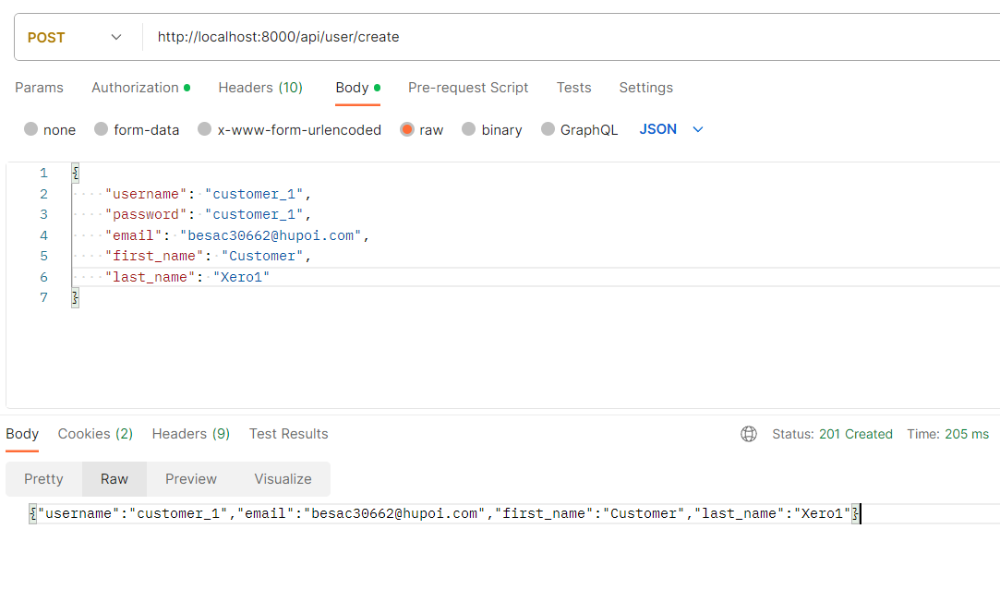
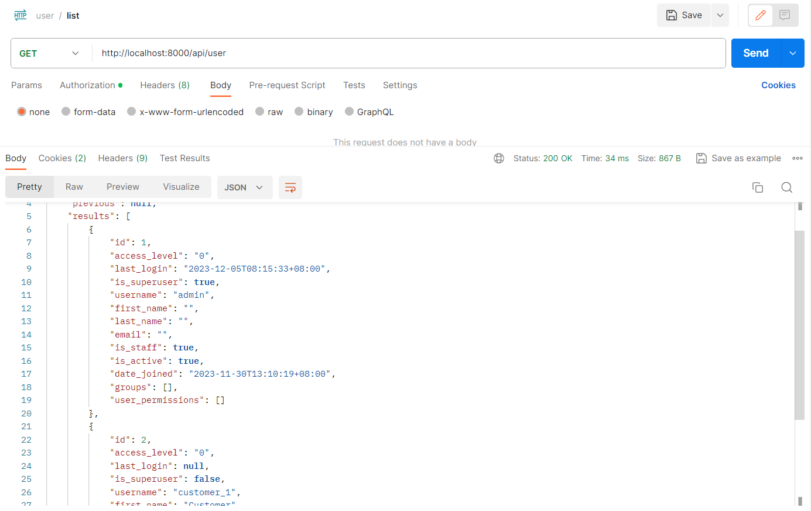
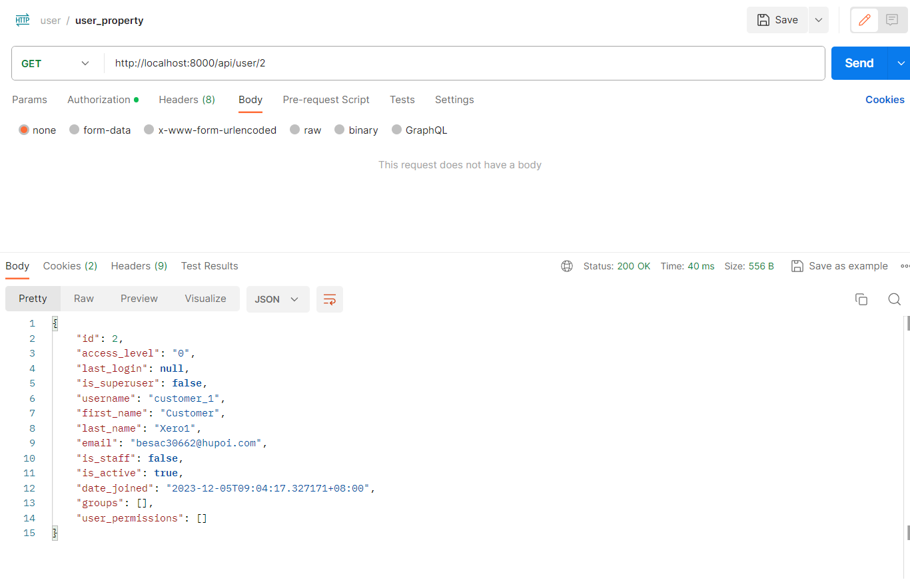
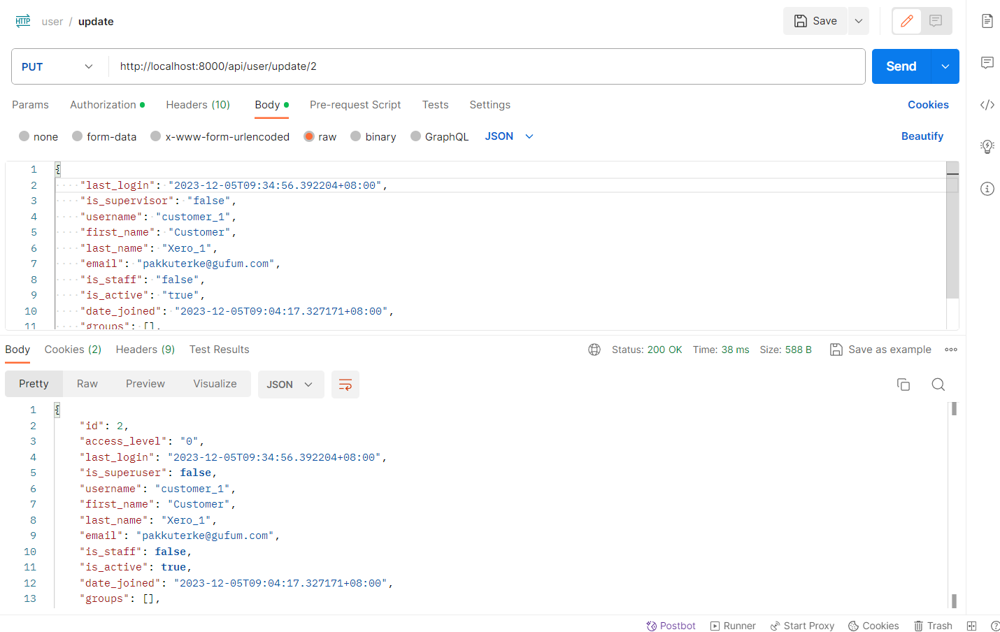

# Backend API

## Create user

Endpoint: `http://localhost:8000/api/user/create`
<figure markdown>
  { width="800" }
  <figcaption>Create user</figcaption>
</figure>

## List all users

Endpoint: `http://localhost:8000/api/user`
<figure markdown>
  { width="800" }
  <figcaption>User update</figcaption>
</figure>

## Individual user property

Endpoint: `http://localhost:8000/api/user/{id}`
<figure markdown>
  { width="800" }
  <figcaption>Individual user property</figcaption>
</figure>

## Update password

Endpoint: `http://localhost:8000/api/user/changepassword`
<figure markdown>
  { width="800" }
  <figcaption>Update password</figcaption>
</figure>

## Update user information

Endpoint: `http://localhost:8000/api/user/update`
<figure markdown>
  { width="800" }
  <figcaption>Update user information</figcaption>
</figure>